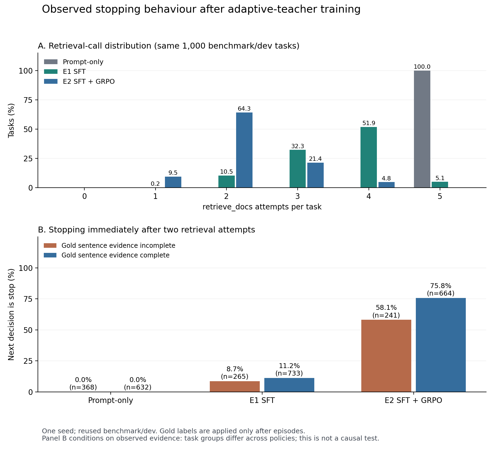

# Personal RAG: Tool-Using RAG Agent and Agentic RL

[](https://github.com/Chenypovo/RAG-Agent-with-SFT-and-GRPO/actions/workflows/tests.yml)

Personal RAG is a local-first agent system for private knowledge bases and workspace tasks. It combines hybrid retrieval, long-term memory, a guarded multi-step tool loop, and a verifier-driven Agentic RL pipeline for post-training a retrieval controller.

The repository contains two connected layers:

1. **Agentic RAG runtime**: document ingestion, hybrid retrieval, evidence-grounded generation, durable memory, calculator and read-only workspace tools.
2. **Agentic RL research stack**: a reproducible multi-turn environment, HotpotQA data preparation, teacher trajectories, QLoRA SFT, custom on-policy GRPO, paired evaluation and artifact provenance.

**Latest experiment, 5 September 2026:** frozen-7B adaptive-teacher SFT improved Answer EM from 43.9% to 48.0% on 1,000 matched HotpotQA benchmark/dev questions. The subsequent 20-update GRPO reduced retrieval calls but lowered accuracy and retained a strong two-call stopping tendency. See the [full report](docs/ADAPTIVE_TEACHER_20260905_REPORT.md) and [versioned evidence](data/agent_rl/reports/adaptive_teacher_20260905/README.md). These results are separate from the historical fixed-two-hop E0 experiments below.

## Highlights

- **Multimodal ingestion** for TXT, Markdown, PDF, images with OCR, and video frames.
- **Structure-aware chunking** with token budgets, paragraph and sentence boundaries, heading hierarchy, page numbers, block types, character offsets, and media metadata.
- **Hybrid retrieval** using dense vectors, BM25, reciprocal-rank fusion, and a BGE cross-encoder reranker.
- **Parent-child retrieval** that indexes small chunks but expands selected evidence to a bounded section or neighboring window.
- **Long-term memory** backed by SQLite and a separate vector index, with conservative add, update, supersede, and delete rules.
- **Multi-step ToolAgent** with strict JSON actions, planning, retries, step and call budgets, duplicate-loop detection, and complete trajectories.
- **Safe workspace tools** for `glob_files`, `grep_text`, and `read_file`, disabled unless a workspace root is explicitly provided.
- **Verifier-driven Agentic RL** with answer, sentence-evidence, document-evidence, joint-success, behavior, and cost metrics.
- **Reproducible post-training** with QLoRA SFT, action-token-only GRPO, a frozen reference adapter, reward-hacking checks, and SHA-256 provenance.

## System Overview

```text
User request
    |
    v
ToolAgent controller
    |-- retrieve_docs --> dense + BM25 --> RRF --> BGE reranker
    |-- read_memory / write_memory --> guarded long-term memory
    |-- calculator
    |-- glob_files / grep_text / read_file --> bounded workspace access
    |
    v
Evidence-separated finalizer
    |-- document evidence
    |-- read-only tool artifacts
    |-- recalled user memory
    `-- confirmed side effects
```

The legacy single-turn router is retained as a baseline. The main ToolAgent repeatedly selects one action, observes the result, and either continues or requests final synthesis. Tool failures are returned as observations so the controller can recover instead of crashing the request.

## Installation

```bash
python3 -m venv .venv
source .venv/bin/activate
python -m pip install -r requirements.txt
cp .env.example .env
```

Example local embedding configuration:

```bash
LLM_PROVIDER=openai_compatible
OPENAI_COMPAT_API_KEY=your_api_key
OPENAI_COMPAT_BASE_URL=
LLM_MODEL=glm-4-flash

EMBED_PROVIDER=local
EMBED_MODEL=BAAI/bge-small-zh-v1.5
EMBED_DEVICE=cpu
```

Build an index and start the application:

```bash
python scripts/build_index.py --input-dir data/uploads --embed-backend local
uvicorn app.api.server:app --port 8000
```

The command-line chat interface is also available:

```bash
python scripts/chat_demo.py
```

> **Deployment boundary:** the current API and web interface are a local, single-user demo. Requests share the same `data/memory/` directory. Authentication, tenant isolation, and rate limiting are not implemented, so the service should not be exposed directly as a public multi-user endpoint.

## Agentic RAG Evaluation

### Frozen retrieval benchmark

The repository includes a small public regression benchmark that can be run after cloning:

- 11 Markdown documents and 20 indexed chunks;
- 40 queries and 46 binary relevance labels;
- chunk-level labels in `source#chunk_id` form;
- frozen FAISS and BM25 assets under `data/index_eval/`.

Run the non-reranked benchmark:

```bash
EMBED_MODEL=BAAI/bge-small-zh-v1.5 python scripts/eval_retrieval.py \
  --vector-store faiss \
  --index-path data/index_eval/faiss.index \
  --meta-path data/index_eval/metadatas.json \
  --bm25-path data/index_eval/bm25.json \
  --queries data/eval/queries_synth.jsonl \
  --qrels data/eval/qrels_synth_chunk.jsonl \
  --backend all --ks 1,4 --embed-backend local --no-strict \
  --output-json data/eval/retrieval_synth_chunk_report.json
```

Add `--rerank` to evaluate the BGE reranker. The frozen results are:

| Pipeline | Recall@1 | Recall@4 | MRR@4 |
| --- | ---: | ---: | ---: |
| Dense | 0.5125 | 0.8375 | 0.6896 |
| BM25 | 0.7375 | 0.9000 | 0.8521 |
| Hybrid | 0.6000 | **1.0000** | 0.8042 |
| Dense + reranker | 0.7625 | 0.9500 | 0.8792 |
| BM25 + reranker | **0.7875** | **0.9750** | **0.9042** |
| **Hybrid + reranker** | **0.7875** | **0.9750** | **0.9042** |

These numbers apply only to the frozen text benchmark, local `BAAI/bge-small-zh-v1.5` embeddings, and chunk-level labels. OCR and video retrieval are supported by the runtime but are not represented in this benchmark.

### Parent-window ablation

For heading-free documents, expanding a retrieved child chunk to a three-chunk window was the best measured coverage/cost point:

| Window | Top-4 answer coverage | Context tokens |
| ---: | ---: | ---: |
| 1 | 0.900 | 349 |
| 2 | 0.900 | 612 |
| **3** | **0.975** | 891 |
| 5 | 0.975 | 1,143 |

### Memory retrieval

Personal example data have been removed from this public snapshot.

### ToolAgent benchmark

`app/eval/agent_benchmark.py` evaluates task completion, evidence coverage, tool precision/recall, parse failures, steps, tool calls, and failure categories. The checked-in scripted report is a deterministic regression fixture, not an effectiveness claim about a language model.

```bash
python scripts/eval_agent_frozen.py \
  --tasks data/eval/agent_benchmark_v1.json \
  --output data/eval/agent_benchmark_v1_report.json
```

## Agentic RL Pipeline

The `app/agent_rl/` package turns retrieval control into a verifiable multi-turn environment:

- strict `retrieve` and `final_answer` JSON actions;
- deterministic `reset()` and `step()` transitions;
- maximum-step and tool-call budgets;
- penalties for invalid actions, duplicate calls, premature answers, and budget exhaustion;
- frozen answer finalizers and programmatic answer/evidence verifiers;
- raw prompts, model outputs, parse errors, transitions, rewards, seeds, versions, and hashes in every trajectory.

All questions, answers, contexts, and supporting facts come from HotpotQA. Gold answers and supporting facts are withheld from the controller prompt and used only by the verifier after an episode.

### Data preparation

```bash
python scripts/prepare_hotpotqa_agent_rl.py \
  --limit 2000 \
  --input-parquet /path/to/hotpotqa-train.parquet \
  --source-split train \
  --partition-mode gold_document_hash \
  --output-dir data/agent_rl/hotpotqa_train_2k
```

The 2,000-row training window contained one invalid supporting-fact index, which was explicitly skipped. The remaining 1,999 tasks were split into `1,617/191/191` train/validation/test partitions by connected components over all visible context documents.

### QLoRA SFT

The released SFT-v2/GRPO checkpoints are historical results. Their SFT data came from a legacy scripted teacher that always made two retrieval calls and then stopped. SFT-v2 retained 583 trajectories with complete sentence evidence, produced 1,749 original decisions, and repeated the final pre-stop retrieval action to obtain 2,915 decisions. This corrected the tool/stop ratio but did not remove the fixed-two-hop supervision bias.

The Qwen3-1.7B controller was trained for 2 epochs and 366 optimizer steps with 4-bit NF4 QLoRA. Prompt and observation tokens were masked; loss was computed only on the target JSON action. The final training loss was `0.12492`.

The current default data generator replaces that scripted path with verifier-guided best-of-N distillation: a frozen stronger LLM samples up to four complete trajectories, stops sampling early after a clean evidence-complete candidate, chooses whether to continue or stop after every observation, and may use up to five actions. Gold answers and supporting facts are used only after a complete rollout to select the cleanest evidence-complete candidate; they never enter the controller prompt. The selected action-length histogram and every candidate's verifier result are written to a separate audit artifact.

For this HotpotQA experiment the learned action space is deliberately `retrieve_docs` plus `final_answer`. `calculator` and runtime memory/workspace tools are excluded because HotpotQA does not provide tasks that verify those actions; adding irrelevant tool calls only to diversify labels would corrupt the training objective. This is a retrieval controller, not a claim that every runtime tool was post-trained.

```bash
python scripts/build_agent_teacher_rollouts.py \
  --data-dir data/agent_rl/hotpotqa_train_2k \
  --partition train \
  --teacher-mode llm_best_of_n \
  --teacher-model /path/to/Qwen2.5-7B-Instruct \
  --finalizer-model /path/to/Qwen2.5-7B-Instruct \
  --candidates-per-task 4 \
  --max-steps 5 \
  --output results/teacher-llm/train-rollouts.jsonl \
  --report results/teacher-llm/train.report.json

python scripts/build_agent_sft_data.py \
  --input results/teacher-llm/train-rollouts.jsonl \
  --output data/agent_rl/sft-llm-teacher/train.jsonl \
  --success-metric CompleteSentenceEvidence

python scripts/train_agent_sft.py \
  --config configs/agent_rl/qwen3_1.7b_qlora.json \
  --input data/agent_rl/sft-llm-teacher/train.jsonl \
  --output-dir results/agent-sft-llm-teacher/qwen3-1.7b-qlora
```

The frozen-7B replacement completed on AutoDL RTX 5090D, including real CUDA/QLoRA/7B smoke tests, hybrid-aligned trajectory generation, SFT and 20-update GRPO. The adaptive path uses the existing dense+BM25+RRF+BGE sentence retriever; it requires a prepared sentence index and the embedding/reranker model paths. Exact executed commands and revisions are in the [run evidence](data/agent_rl/reports/adaptive_teacher_20260905/README.md). Historical SFT-v2/GRPO numbers remain attributable to their original fixed-two-hop supervision.

### Multi-turn GRPO: historical E0 configuration

GRPO starts from the SFT-v2 adapter and loads two identical LoRA adapters:

- a trainable `policy` adapter;
- a frozen SFT `reference` adapter used for KL regularization.

Each update samples two tasks and four rollouts per task from the same deterministic initial environment state. Rewards are normalized within each task group. The clipped objective is computed only on generated action tokens using rollout-time, current-policy, and reference-policy token log-probabilities.

The historical E0 run used:

- 20 policy updates and 2 optimization epochs per rollout batch;
- 160 episodes and 525 multi-turn decisions;
- 40 unique task groups sampled from a 128-task capped pool;
- `clip_epsilon=0.2`, `beta=0.04`, and `learning_rate=5e-6`;
- approximately 10.22 GiB peak reserved CUDA memory;
- pre/post SHA-256 verification that the frozen reference adapter was unchanged.

```bash
python scripts/audit_agent_rewards.py \
  --config configs/agent_rl/qwen3_1.7b_grpo.json \
  --output results/agent_rl/reward-hacking-audit.json \
  --overwrite

python scripts/train_agent_grpo.py \
  --config configs/agent_rl/qwen3_1.7b_grpo.json \
  --model /path/to/Qwen3-1.7B \
  --finalizer-model /path/to/Qwen3-1.7B \
  --init-adapter /path/to/sft-v2/adapter \
  --output-dir results/agent-grpo/qwen3-1.7b-sftv2-grpo
```

The reward combines task success and evidence coverage with costs for tool calls, invalid actions, duplicate calls, premature answers, and exhausted budgets. The audit verifies several known reward-hacking paths, but it is not a proof that every possible exploit has been eliminated.

## Adaptive-Teacher SFT and GRPO: E1/E2

The frozen `Qwen2.5-7B-Instruct` teacher and finaliser share one model instance and revision. The full run generated 4,669 candidates across 1,617 training questions, with at most 4 candidates/question and 5 actions/trajectory. Gold answers and supporting facts were used only after each complete candidate. The unchanged clean/complete-evidence filter retained 949 trajectories and 4,541 action examples for Qwen3-1.7B QLoRA SFT; the original 20-update GRPO then started from that new adapter.

All three evaluations use the same 1,000 questions, hybrid retrieval, frozen 7B finaliser, prompts and seed 42. AgentRL preserves sentence IDs and does not enable parent-child expansion.

| Controller | Answer EM | Answer F1 | Joint Success | Complete sentence evidence | Mean retrieval calls | Premature stop |
| --- | ---: | ---: | ---: | ---: | ---: | ---: |
| Prompt-only |43.90% |54.95% |36.60% |66.20% |5.000 |0.0%* |
| E1 adaptive-teacher SFT |**48.00%** |**61.61%** |**43.20%** |**80.70%** |3.512 |17.8% |
| E2 SFT + GRPO |45.60% |57.95% |39.00% |73.60% |2.215 |26.4% |

*Prompt-only never explicitly stopped: all episodes exhausted the five-action budget. Its zero premature-stop rate is not evidence of appropriate stopping. Joint Success requires both an exact answer and complete gold sentence evidence, rather than official HotpotQA Joint EM.*

Paired bootstrap with 2,000 resamples gives an SFT-versus-prompt Answer EM gain of **4.1 pp [1.3, 6.8]**. GRPO versus SFT reduces retrieval calls by 36.93%, but lowers Joint Success by **4.2 pp [−6.5, −1.9]** and Answer EM by **2.4 pp [−4.5, −0.2]**. Thus this run does not support a claim of preserved accuracy.

The fixed teacher labels were replaced, but the final GRPO controller still uses exactly two retrieval calls on 64.3% of tasks. After two calls with incomplete evidence, it stops on 140/241 opportunities (58.09%), compared with 23/265 (8.68%) for SFT. These post-episode conditional groups are descriptive and can contain different tasks. Empty/failed retrieval has no observed exposure, and contradiction recovery has no adjudicated labels.



The [full report](docs/ADAPTIVE_TEACHER_20260905_REPORT.md) separates successes, failures and limitations. [Compact JSON reports, confidence intervals, plots and SHA-256 manifests](data/agent_rl/reports/adaptive_teacher_20260905/README.md) are versioned here. The 6.28 GB full trajectory/checkpoint bundle and base weights remain outside Git; the manifests identify them but are not download links. This is one seed on a reused benchmark/dev set, without reward ablations or scientific retries.

## Historical E0 Hybrid-Retrieval Evaluation

The historical E0 evaluation aligned Agent RL retrieval with the runtime RAG stack:

- `BAAI/bge-small-en-v1.5` dense retrieval in LanceDB;
- BM25 and reciprocal-rank fusion;
- `BAAI/bge-reranker-base` cross-encoder reranking;
- top-15 candidates per retrieval branch and reranked top-6 output;
- a frozen `Qwen2.5-7B-Instruct` answer finalizer;
- the same Qwen3-1.7B prompt/SFT/GRPO controller checkpoints.

On 1,000 fixed HotpotQA validation questions, hybrid retrieval plus reranking increased complete sentence evidence from `34.7%` for BM25@8 to `59.5%` for hybrid-rerank@6.

| Controller | Answer EM | Answer F1 | Joint Success | Complete sentence evidence | Duplicate calls | Budget exhaustion | Mean tool calls |
| --- | ---: | ---: | ---: | ---: | ---: | ---: | ---: |
| Prompt-only | **44.2%** | **55.31%** | 36.1% | 64.2% | 61.78% | 100.0% | 5.000 |
| SFT-741 | 43.3% | 54.02% | 33.5% | 62.1% | **0.00%** | 0.0% | **1.722** |
| SFT-v2 | 43.6% | 54.56% | **36.2%** | **67.7%** | 11.42% | 0.6% | 3.726 |
| SFT-v2 + GRPO | 42.5% | 53.60% | 35.0% | 65.5% | 1.28% | **0.0%** | 2.121 |

Compared with prompt-only control on this stack, GRPO reduced mean tool calls by `57.6%`, reduced duplicate calls from `61.78%` to `1.28%`, and eliminated budget exhaustion. Answer EM changed by `-1.7pp` with a paired 95% confidence interval of `[-4.2pp, +0.8pp]`; Joint Success changed by `-1.1pp` with `[-3.5pp, +1.5pp]`. These intervals cross zero, so the result supports a behavior-efficiency claim, not an answer-quality improvement claim.

The historical old-to-new stack gain combines retrieval, reranking, and the larger frozen finalizer. It must not be attributed to GRPO alone. This E0 adapter was trained under BM25 observations; the separately reported E1/E2 run above trains new adapters with hybrid observations and leaves all E0 metrics and artifacts unchanged.

Run the four-controller experiment after adjusting the model and adapter paths in the environment variables:

```bash
ROOT="$PWD" \
PYTHON_BIN="$PWD/.venv/bin/python" \
BASE_MODEL=/path/to/Qwen3-1.7B \
FINALIZER_MODEL=/path/to/Qwen2.5-7B-Instruct \
EMBEDDING_MODEL=/path/to/bge-small-en-v1.5 \
RERANKER_MODEL=/path/to/bge-reranker-base \
DATA_DIR="$PWD/data/agent_rl/hotpotqa_validation_1k" \
RESULT_DIR="$PWD/results/agent-rl-hybrid-7b" \
bash scripts/run_agent_rl_hybrid_7b_experiments.sh
```

## Reproducibility and Reports

Machine-readable manifests and compact reports are committed under `data/agent_rl/manifests/` and `data/agent_rl/reports/`. Reports include hashes or exact versions for the source data, model artifacts, configuration, training code, adapters, and runtime dependencies.

Detailed reports:

- [Frozen 7B adaptive teacher: full E0/E1/E2 report](docs/ADAPTIVE_TEACHER_20260905_REPORT.md)
- [E1/E2 compact metrics, statistical comparisons and checksums](data/agent_rl/reports/adaptive_teacher_20260905/README.md)
- [Agentic RL experiment report](docs/AGENTIC_RL_EXPERIMENT_REPORT.md)
- [Hybrid retrieval and 7B finalizer report](docs/AGENTIC_RL_HYBRID_7B_EXPERIMENT_REPORT.md)
- [Released adapter, trajectories, and logs](https://github.com/Chenypovo/Personal_RAG/releases/tag/agentic-rl-qwen3-1.7b-2026-08-06)

The 1,000-question validation set is isolated from training data, but it was reused for diagnostics and design iteration. It is therefore a fixed benchmark/dev set, not an untouched final test. The current results use one sampling seed.

## Tests

```bash
python -m pytest -q
```

CI also reruns the frozen BM25 retrieval check. GPU-only SFT and GRPO execution paths have CPU-side unit tests for configuration, loss computation, adapter guards, artifact handling, and training control flow.

## Repository Layout

```text
app/
  agent/          Tool loop, registry, tools, trajectories
  agent_rl/       Environment, policies, rollouts, verifiers, SFT and GRPO logic
  chunker/        Structure-aware chunking
  embedder/       Local and API-compatible embeddings
  eval/           Agent benchmark and failure analysis
  generator/      Evidence-grounded final synthesis
  loader/         Text, PDF, OCR and video ingestion
  memory/         Extraction, guarded merge, storage and retrieval
  retriever/      Dense, sparse, hybrid and parent-child retrieval
  vectordb/       LanceDB, FAISS and BM25 stores
configs/agent_rl/ Training and evaluation configurations
data/agent_rl/    Versioned manifests and compact experiment reports
docs/             Detailed experiment reports and design notes
scripts/          Build, train, evaluate and comparison entry points
tests/            Runtime, evaluation and post-training tests
```

## Current Limitations

- The web/API layer is not production multi-tenant infrastructure.
- Prompt-based JSON tool calling is more fragile than provider-native function calling; parse failures are measured and surfaced.
- Workspace tools are intentionally read-only and bounded.
- The checked-in ToolAgent fixture is for deterministic regression, not model-quality benchmarking.
- Agentic RL results use one reused benchmark/dev set and one sampling seed; paired task intervals do not establish variation across training seeds.
- Adaptive-teacher SFT improves the matched answer/evidence metrics, but its retained training trajectories concentrate near four retrieval calls; calibrated stopping is not established.
- The subsequent GRPO reduces retrieval calls at the cost of accuracy and retains a strong two-call stopping tendency. Empty/failed/contradictory retrieval recovery remains unestablished.
- Historical SFT-v2/GRPO metrics retain their legacy fixed-two-hop provenance and are not relabelled as frozen 7B-teacher results.
